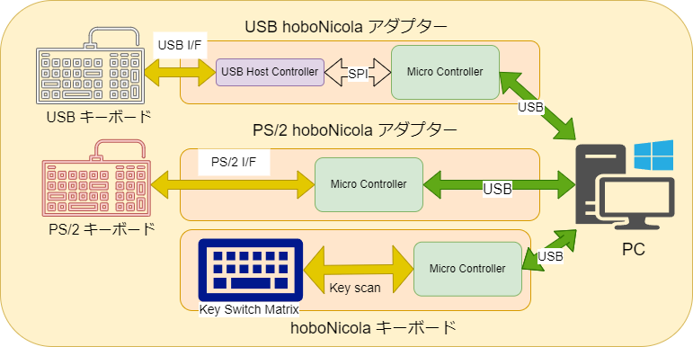
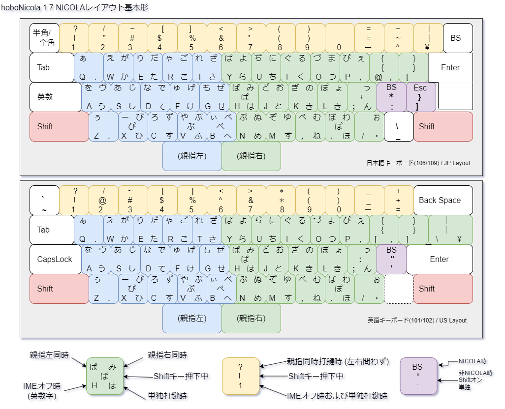

# Hobo-nicola keyboard and adapter library for Arduino environments.

hoboNicola keyboard and adapter library.  Copyright (c) Takeshi Higasa, okiraku-camera.tokyo

これまでのhoboNicolaLibraryの履歴などについては、[ブログの投稿](https://okiraku-camera.tokyo/blog/?page_id=8211)を参照してください (以下の内容と重複する箇所もあります)。

## hoboNicolaについて 

hoboNicolaライブラリは、一般的なUSBキーボードをほぼNICOLAキーボードとして使うためのアダプター用ファームウェアとして2018年頃に作りました。このライブラリを使うことで、入力時の配列を(ほぼ)NICOLA配列にすると同時に、NICOLA規格に準じた親指キー同時打鍵入力が可能となります。hoboNicolaライブラリを組み込んだアダプター(USB-USB, PS/2-USB)のことを、hoboNicolaアダプターと称しており、回路などはブログ等で公開されています。

hoboNicolaアダプターはPCなどのホスト側に接続したときふつうのUSBキーボードのように振る舞います。アダプターは物理的なキーボードからの受けたHID Usage ID(キーコード)を使って配列の変更や同時打鍵処理などを行った後、ホストにキーコードを送り出します。

このライブラリは、日本語USBキーボードだけではなくPS/2インタフェースのキーボードや、USレイアウトのキーボード用のアダプターとしても使うことができます。また、キーボードPCBのマイコンに組み込むことで使い手の都合に合わせた親指シフトキーボードのファームウェアとすることも可能です。

## 配列について
hoboNicolaアダプターやキーボードの、NICOLAモードでの文字記号配列は以下のようにしています(バージョン1.7.0以降)。

NICOLA規格での配列規定とは若干ことなっているので、「ほぼ」NICOLAと称してます。

NICOLA規格の詳細については、http://nicola.sunicom.co.jp/spec/jisdraft.htm を参照してください。

## 親指キーについて
hoboNicolaは、アダプターに接続したキーボードから出力されるキーコードや、hoboNicolaを組み込んだキーボード(hoboNicolaキーボード)の基本配列に定義されているコードに基づいて、上図のような配列への変更や親指キー同時打鍵処理を行います。左右の親指キーに割り当てることができるキーは以下のようになっています。

|親指キー|(初期設定)|設定1|設定2| 
|---------|---------|---------|---------|
|親指左|無変換(F14)キー|空白キーまたは無変換(F14)キー|無変換(F14)キー|
|親指右|変換(F15)キー|変換(F15)キー|変換(F15)キーまたは空白キー|

Windowsのハードウェアキーボードレイアウトを「英語キーボード(101/102キー)」としている場合、変換キーや無変換キーは使えません。そういった場合、F14およびF15キーで代用することにしています。

アダプターの場合、接続しているキーボードで同時打鍵に使う親指キーの出力コードのカスタマイズにより、F14やF15を出力する必要があります。

hoboNicolaキーボードではUSレイアウトで使うとき、無変換をF14に、変換をF15に置き換えて出力するようにしています。

この表にないキーを親指キーとして使うためには、プログラムの若干の変更が必要になります。ただ、左右の親指キーの単独打鍵は日本語入力IMEに対する変換操作の指示でもあるため、親指キーとして使うキー(コード)を変更するときには、IMEのカスタマイズも関係してくることを意識しておく必要があります。

## ハードウェアについて
hoboNicolaアダプターは、コントローラとして使うマイコンと、USBやPS/2といったキーボードインタフェース回路を組み合わせたものです。物理的なキーボード側はUSBホストとしてふるまい、PCなどのホストと接続する側はUSBデバイスとしてふるまう必要があります。USBデバイスとしての機能を備えたマイコンを使ったArduinoボードやオリジナルのPCBと、MAX3421EEなどのUSBホストコントローラを組み合わせるのが一般的な構成方法です。

### Arduinoボード(アダプター用)
今まで動作を確認しているArduinoボードは以下のとおりです。ビルドのためには各ボード用のBSP (Board Support Package)あるいはコアパッケージの導入が必要です。

* AVR
  * Arduino Leonardo (ATmega32u4 +5V/16MHz)
  * SparkFun Pro Micro (ATmega32u4 +3.3V/8MHz and +5V/16MHz)
* SAMD21  (Adafruit SAMD Boards 1.7.13)
  * Adafruit QTPy SAMD21 (SAMD21E18)
  * Seeed Studio XIAO SAMD21, Seeeduino XIAO (SAMD21G1)
* nRF52840 (Adafruit nRF52 Boards 1.6.0)
  * Seeed Studio XIAO nRF52840
  * SwitchScience ISP1807 Micro Board
* RP2040 (Arduino-pico 3.7.2)
  * Seeed Studio XIAO RP2040
  * Adafruit KB2040
  * Raspberry Pi Pico

(For building with microcontrollers other than AVR (such as SAMD, nRF52, RP2040), the Adafruit TinyUSB library is required).

AVRやRP2040については、オリジナルPCBでの動作も確認しています。

## ビルドについて

hoboNicolaLibrary はArduinoのライブラリとして導入することを前提としています。

現在のところ以下の開発ツールでビルドできることを確認しています。
* Windows用のArduino(1.8.19) 
* Visual Studio Code(1.80.0) Arduino-extension 0.6以降 とarduino-cliが導入済みであること。
* Arduino IDE (2.x.x) でもビルドできると思いますが確認していません。

いくつかのUSBホストコントローラー用の実装やキーボードPCB用の実装は Arduino スケッチ (.inoファイル) として examples ディレクトリに入っているので、ターゲットとするデバイスやマイコンに応じたスケッチを開き、別名で保存するところから、開発を始めることができます。

### アダプター実装例 (examples)

USBホストコントローラーごとに実装例を用意してあり、USBキーボード用の実装は4種類のマイコン(ATMega32U4, ATSAMD21, nRF52840 and RP2040)での動作を確認しています。AVR以外のマイコンを用いる場合、Adafruit TinyUSB ライブラリの導入が必須です。

* ch9350_hobo_nicola	
  * CH9350L をUSBホストコントローラーとして用いるアダプター用の実装です。
* usb_hobo_nicola
  * MAX3421EE (USB Host Shield) をUSBホストコントローラーとして用いるアダプター用の実装です。[felis/USB_Host_Shield_2.0](https://github.com/felis/USB_Host_Shield_2.0) に依存していますが、hoboNicola用の修正を加えた一式をhoboNicolaLibrary内に含んでいるので新たな導入は不要です。
* rp_hobo_nicola
  * 専用のUSB-Hostコントローラを用いずRP2040単独で構成するアダプター用の実装です。この実装では、[sekigon-gonnoc/Pico-PIO-USB](https://github.com/sekigon-gonnoc/Pico-PIO-USB) と [Adafruit_TinyUSB Library](https://github.com/adafruit/Adafruit_TinyUSB_Arduino) が必須です。
* ps2_hobo_nicola
  * PS/2キーボード用アダプターの実装例でATMega32U4のみが対象です。

### キーボード実装例 (examples)
hoboNicolaLibraryを組み込んだ自作キーボード用の実装例です。RP2040を使ったキーボードでは、Adafruit TinyUSB ライブラリの導入が必須です。

* xd87
  * XD87 PCB (https://kprepublic.com/) を使った自作キーボード用の実装です。ターゲットのマイコンは ATMega32U4 (+5V/16MHz) なので Arduino Leonardo または SparkFun Pro Micro をターゲットしてビルドします。このキーボードについては [こちらを参照のこと](./assets/xd87.md)。
* xd64
  * XD64(ver3) PCB ver3 (https://kprepublic.com/) を使った自作キーボード用の実装です。ターゲットのマイコンはXD87と同じです。このキーボードについては [こちらを参照のこと](./assets/xd64.md)。
*	nk60_hobo_nicola
	* RP2040を載せたオリジナルPCBを使った自作60%キーボード用の実装です。ハードウェアについては、[ブログの投稿を参照](https://okiraku-camera.tokyo/blog/?p=16074)。
*	nk80_rev2_hobo_nicola
	* RP2040を載せたオリジナルPCBを使った自作80%キーボード用の実装です。[ こちらを参照](./assets/nk80_rev2.md)。

なお、hoboNicolaライブラリを自作キーボードに適用する際には、キーボードPCBの回路構成を知っておく必要があります。

### 履歴
* 1.7.7
	* お恥ずかしい話ですが、"Arduino.h" を "arduino.h" と書いてあるソースファイルがいくつかあって、Linuxでビルドできなかったので修正。
	* **オプションU の動作を若干変更**。U(USレイアウト)を有効にしたとき、同時にオプションZ(無変換,変換キーをF14,F15キーに)も有効になる。<u>ただし、Uが有効のときにZ単独で無効にできる</u>。つまり、USレイアウトを選択していてもWindowsの無変換や変換キーのコードを出力できるようにした。これは Ubuntuのmozcで使うときF14やF15キーのコードよりも、無変換や変換キーのコードを出した方が都合が良さそうだからです。
	* 以下のコアパッケージおよびライブラリで動作確認しています。
		* Adafruit Tiny USB Arduino (3.2.0).
		* Arduino-pico (3.9.3)
		* PICO Pio USB (0.6.0)
		* Adafruit nRF52 (1.6.1)
		* Adafruit ArduinoCore-samd (1.7.13)
		* Arduino AVR core (bundled). 	

* 1.7.6
	* 左親指キーが無変換またはF14のとき、Enterキーのコードを出すオプション (設定Y)を追加。F14/無変換を左親指キーとしているときに使う。無変換操作（半確定操作）を行わないときに使う。
	* TinyUSB 2.4.0以降(3.1.1まで確認)に対応 (バグのワークアラウンド)。

* 1.7.5
  * MacOSへの対応のため、以下のような変更を実施した。
  * レポートディスクリプタを修正。 
  * nk60 キーボードの基本レイアウトを変更。
   * 変換(F15)キーでNICOLAモードをオンにする設定オプション (設定J) の追加
   * ホストに対するコード出力時の遅延を短くするオプション (設定R) の追加。
   * 無変換キー、変換キーを常にF14, F15キーに置き換えて出力するオプション(設定Z)の追加。
   * CapsLockキーをレイアウト設定に関わらずImeOffキーとする ( 設定I ) 。従来はUS Layout時にのみ有効としていた。

* 1.7.4
  * NK80 rev2 PCBに対応。examples/nk80_rev2_hobo_nicolaを追加。
  * NK60 rev3 PCBへの対応を変更。examples/nk60_hobo_nicola の修正(PWM LED関係)。
  * ライブラリの小変更など。

### ギャラリー

アダプターやキーボードの[フォトギャラリーはこちら](./assets/hobonicola_gallery.md) 。

## What's hobo-nicola 

The hobo-Nicola library is firmware for hardware adapters that allow general Japanese USB keyboard to be used as "almost NICOLA keyboard". By using this library, you can get (almost) NICOLA layout kayboard. And at the same time, you can use simultaneous typing method with Thumb-shift keys according to the NICOLA standard. Adapters (USB-USB, PS/2-USB) that incorporate the hobo-Nicola library are called hobo-Nicola adapters, and their circuits are publicly published.

The hoboNicola adapter behaves as a USB HID keyboard when connected to a host such as PC. The adapter uses the HID Usage ID (keycode) received from the physical keyboard to change the layout and perform simultaneous keystroke processing, etc., and then sends the keycode to the host.

This library can be used not only for Japanese USB keyboards, but also as adapters for PS/2 interface keyboards and US layout keyboards. In addition, it is also possible to make the firmware of the keyboard itself. You can build the almost NICOLA keyboard by incorporating this library into the micro controller of the keyboard PCB.

## What's NICOLA keyboard

The NICOLA keyboard is one of the keyboard standards for typing Japanese using PCs and WSs, established at the end of the 20th century. This standard inherits the input method of a dedicated word processor called ”OASYS", which had been manufactured by Fujitsu.

It features a unique key layout for typing the many Japanese kana and symbols with fewer keys. And it has a simultaneous typing method with the two Thumb-shift keys to select kanas, numbers and symbols from multiplexed keys.

For details, please refer to the following site (written in Japanese). http://nicola.sunicom.co.jp/spec/jisdraft.htm

### Photo gallery

Photo gallery of adapters and keyboards is [here](./assets/hobonicola_gallery.md) 

