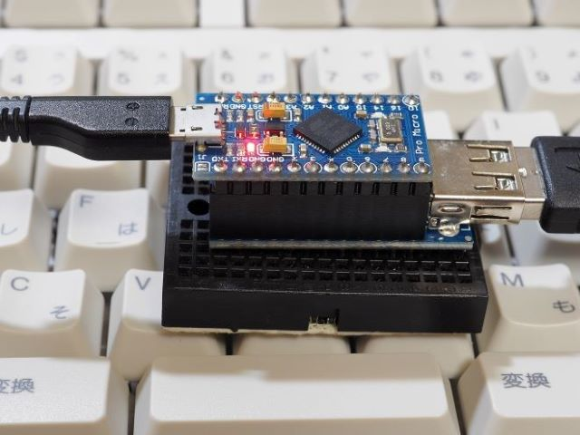
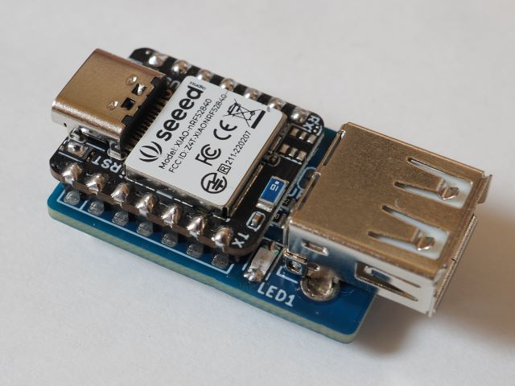
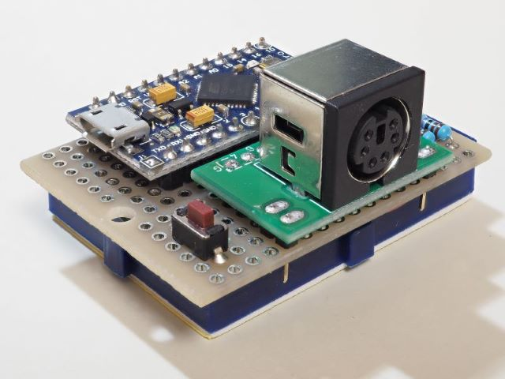
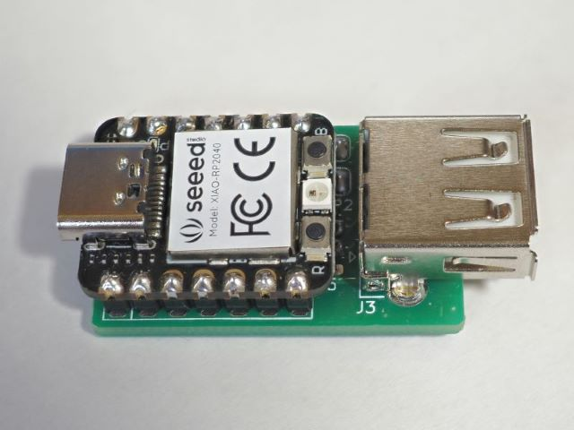
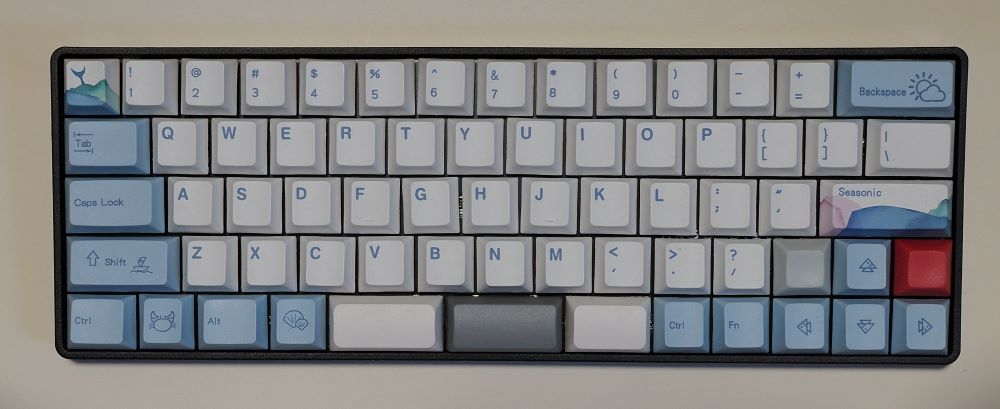
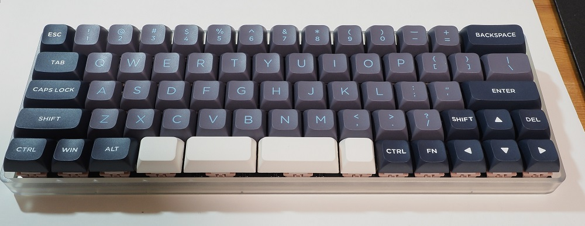
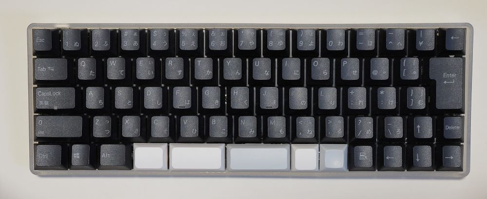
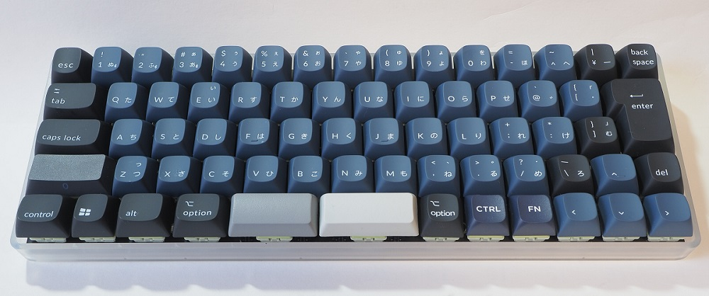

# Gallery
## USB hoboNicola. SparkFun promicro and mini USB Host Shield V2.

## USB hoboNicola. Seeed XIAO nrf52840 and MAX3421EE.

## PS/2 hoboNicola. SparkFun promicro and PS/2 (mini DIN) connector.

## RP hoboNicola. XIAO RP2040 using PICO-PIO-USB library.

## XD64 ver3, JP layout
ATMega32U4

## XD87, US layout
ATMega32U4

## NK60 rev02, US layout
RP2040

## NK60 rev031, JP layout
RP2040

( XVX Profile Keycaps set.)

## NK60 rev031, JP layout
RP2040

( ARCHISS JIS Keycaps set.)

( Keychron JIS Keycaps set.)

[戻る/Back](../README.md)