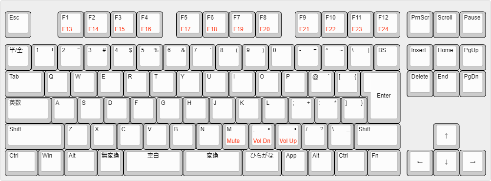
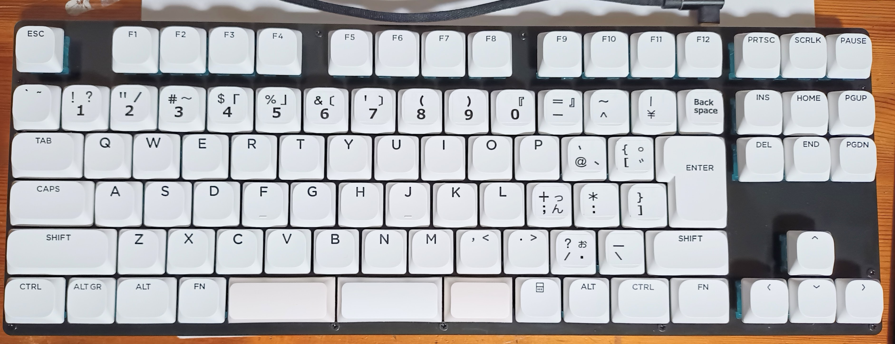
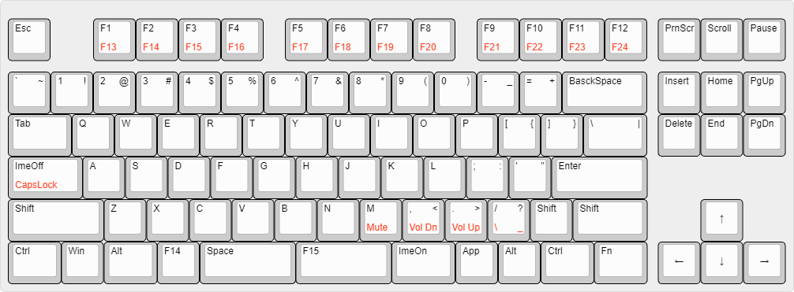
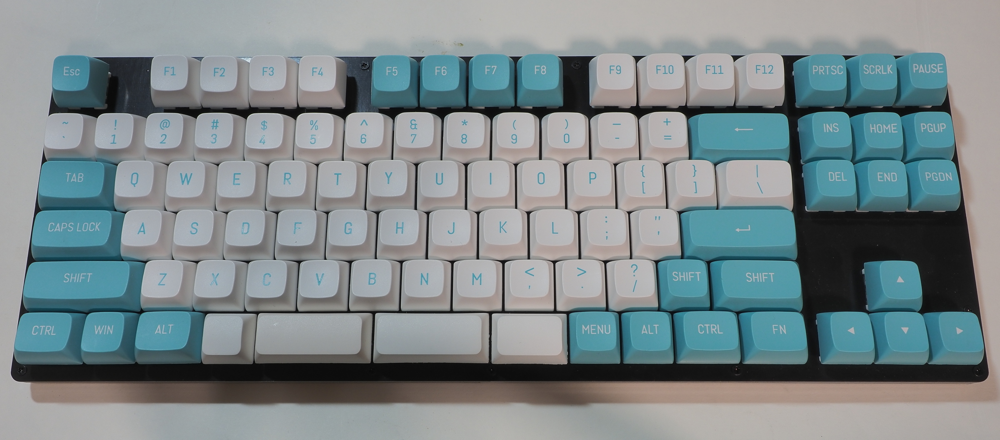

# nk80 PCB (rev.2)を使った ほぼNICOLAキーボード (1.7版)

自作のPCBを使った80%サイズのおおむねNICOLAキーボードです。ハードウェアの概要は以下のとおり。

* マイコンはRP2040で、フラッシュメモリとして WS25Q128 (16MBytes)を実装。
* PCBのB面に、RESETおよびBOOT_SEL用のスイッチを配置。強制的にブートローダーモードとできる。
* スイッチマトリックスは6行16列構成で、最大で96キーまで対応。
* 日本語レイアウトとした場合は92キー、USレイアウトとした場合は91キー構成となる。
* 日本語レイアウトが基本だが、ほぼUSレイアウトにも対応可能。特に特徴のない、親指キーが打ちやすいだけのTKLキーボードとすることを意図した。
* ファームウェアは、hoboNicolaLibraryのexamples/nk80_rev2_hobo_nicola に格納。

## JPレイアウト
日本語レイアウトとしたときの基本配列（hoboNicolaの設定オプションをすべてオフとしているときの配列）は以下のとおり。

* 一般的な日本語キーボードに準じて、空白キー周辺のキーを並べている。
* 60%キーボードと比べて、Fnキーオンのときの配列変更は少ない。

* 日本語レイアウトでの実装例。
* USレイアウト用のロープロファイルのキーキャップに、親指シフト配列に見せるためのシールをいくつか貼っている。

## USレイアウト
### 基本レイアウト
hoboNicolaライブラリの各種設定オプションのうち、USレイアウトのみを適用してたときの配列（基本配列）は以下のとおり。

* Windowsのハードウェアキーボードレイアウトを「英語キーボード101/102」としているときに使うレイアウト。
* Back Space, Back Slash, EnterなどについてはUSレイアウトと同様に配置される。右Shiftについては、スタビライザー使いたくなかったのでこういった具合に2つにした。
* 「英語キーボード101/102」としている場合、Windowsによって無変換、変換、ひらがな といったIME操作用のキーが無効化されるので、代わりにImeOnやF14, F15といったキーを配置している。
* ImeOn,ImeOffは、それぞれ Keyboard PageのUsage ID 0x90および0x91。これらのコードはIMEの開閉を行うためのもの。
* Windows用のGoogle日本語入力やMS-IMEといったIMEをカスタマイズすることで F14キーとF15に、無変換キーと変換キーが担う機能を設定することができる。
* そのあたりの設定列については、[ブログの投稿](https://okiraku-camera.tokyo/blog/?p=16363) を参照のこと。

* USレイアウトでの実装例。
* MacOSで利用する場合、Fnキーオンで小さい方のShiftキーを押すと、キーボード設定時に「日本語キーボード」として認識させることができる。そうすることで、ANSI配列でIMEの開閉を親指キーの左右のキーで行わせることもできる (1.7.6版から)。

## 備考など
* hoboNicolaの設定オプションによる各種変更の内容については、[ほぼNICOLA化プログラム hoboNicolaのページ](https://okiraku-camera.tokyo/blog/?page_id=8211)を参照のこと。
* ビルドには、Arduino-pico 3.7.2、Adafruit TinyUS Library 3.1.1が必要。
* ファームウェアの更新は、RP2040のブートローダーモードによって作成されるドライブにUF2ファイルをドロップすることで行う。ブートローダーモードの開始は、特定のキーコンビネーションやハードウェアスイッチの操作によって行う。USBを介した仮想シリアルポートは作成していない。
* 回路図などは準備中。

[戻る/Back](./about_hoboNicola_jp.md)
