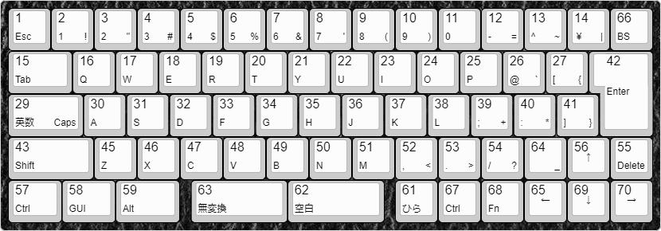
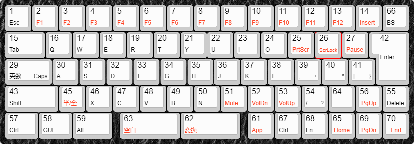
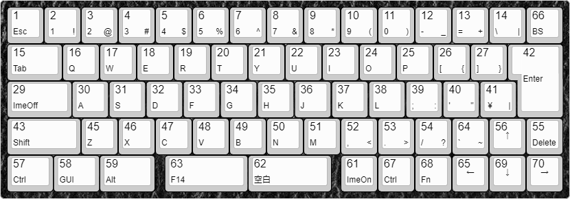
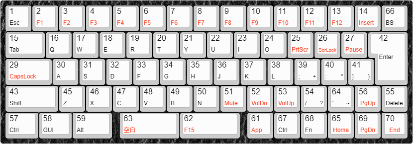

# XD64 (ver3) PCBを使った ほぼNICOLAキーボード (1.7.0版)

[kprepublic.com](https://kprepublic.com/collections/xd64-60) で売っている XD64 PCB Ver3.0 を使った親指シフト(NICOLA)型のキーボードです。PCBやスイッチプレート自体は2020年頃に購入しました。

* このPCBは、5行14列のキースイッチ・マトリックス回路を備えています。今回は、67個のスイッチを使った日本語キーボードタイプのレイアウトとしました。
* いわゆる60%キーボードであるため、いくつかの編集機能キーやファンクションキーについては、固定的なFnキーを押しながら入力する必要があります。
* ISO Enter (7 shaped Enter) を使うようにしたので、日本語レイアウト用のキーキャップをはめていますが、WindowsをUSレイアウトにした場合も考慮しています。
* このキーボードの回路についての考察などは、[ブログの投稿](https://okiraku-camera.tokyo/blog/?p=15335) を参照してください。
## レイアウト図 (日本語レイアウト)

以下のレイアウト図は、xd64 ver3 PCB の各スイッチの出力コードを表しており、各キー内の文字、記号、数字はWindowsのキーボードレイアウトが `日本語キーボード(106/109キー)` であることを前提しています。

### Fnキーを押してないとき(通常時) [xd64_nicola_jp_1.json](./images/xd64_nicola_jp_1.json)

### Fnキーを押しているとき [xd64_nicola_jp_1_fn.json](./images/xd64_nicola_jp_1_fn.json)

* 各キーの大きな数字は内部スキャンコードです。内部スキャンコードとは、キースイッチマトリックス回路における列と行の交点(スイッチ位置)を一意に表す番号で `(行番号 – 1) × 14 + 列番号` で算出しています。
* キーと出力コードの関係は、xd64.cpp内のコード配列 `scan_to_hid_table[ ][ ]` で定義しており、この配列には内部スキャンコード順にHID Usage IDが書いてあります。基本的な出力コードを変更する場合は、この内容を書き換えることになります。 
* Fnキーオンのとき、赤い字で書いてあるキーは通常時と異なるコードを出力します。それ以外のキーは通常時と同じコードを出力します。
* 変換キーは優先順位が低いのでFnキー側にのみ割り当てています。
* NICOLAモードの場合、キースキャンの結果として得られる出力コードがNICOLA配列の範囲内にあるとき、あらためてNICOLA配列に変換してから同時打鍵の検出処理などを行うことになります。キースキャン結果をいったんHID Usage ID に変換することで、キーイベント検出後の処理をhoboNicolaアダプターと共通化しています。

## レイアウト図 (USレイアウト)
Windowsのキーボードレイアウトを `英語キーボード(101/102キー)` としたときのレイアウトです。

* hoboNicolaの動作設定で、 `U : US LAYOUT`  を有効にしている必要があります。
* USレイアウトのときには、日本語キーボードが出力する一部のキーコードはWindowsによって無視されます。そのため、日本語キーボードでの無変換キーはF14に、変換キーはF15に置き換えています。
* さらに、ひらがなキーはImeOnに、英数キーはImeOffとしています。

### Fnキーを押してないとき(通常時) [xd64_nicola_us_1.json](./images/xd64_nicola_us_1.json)

* Escキーの位置あるはずの アクサングラブ／ティルダ (` / ~) は、日本語レイアウトでのアンダースコアの位置に移動。
* BackSpaceの隣はUSキーボードでのバックスラッシュ (HID 0x31)、Enterキーの隣はHID Usage ID 0x32です。NICOLAモードのときにEscキーとなります。
* `ImeOn` と表記しているキーは、HID Usage ID 0x90 (Keyboard LANG1) を出力します。hoboNicolaLibraryでは、`HID_IME_ON` と定義しています。
* `ImeOff` と表記しているキーは、HID Usage ID 0x91 (Keyboard LANG2) を出力します。hoboNicolaLibraryでは、`HID_IME_OFF` と定義しています。

### Fnキーを押しているき [xd64_nicola_us_1_fn.json](./images/xd64_nicola_us_1_fn.json)

* 赤い字で書いてあるキーがFnキーオンのときに通常時と異なるコードを出力します。それ以外のキーは通常時と同じコードを出力します。
* USレイアウトでのCapsLockキーは、Fnキーを押しながら入力する必要があります。ほとんど使わないのでFnキー側にのみ配置することにしました。

## ビルドについて
このPCBに実装されているマイコンは `Atmel ATMega32U4(+5V, 16MHz)` で、このマイコンには AtmelのDFUブートローダーが書き込まれています。	Arduino (IDEもしくはarduino-cli) でビルドするときには Arduino Leonardo もしくは SparkFun Pro Micro(+5V/16MHz) として行います。そしてキーボード内のマイコンを `DFUブートローダーモード`とし、できあがったHEXファイルを ATmel Flip などのツールで書き込みます。DFUブートローダーモードは、キーボードマイコンのリセット、あるいは、hoboNicola が備えているキー入力操作 (Fn+右Ctrl+左Ctrl+B) で開始します。

[戻る/Back](./about_hoboNicola_jp.md)