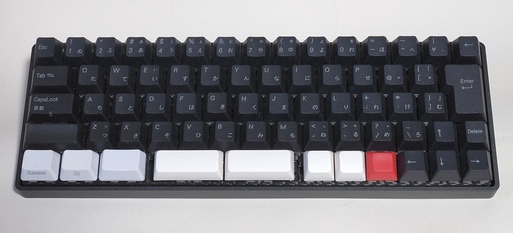

# XD64 (ver3) PCBを使った ほぼNICOLAキーボード (1.7.0版)

[kprepublic.com](https://kprepublic.com/collections/xd64-60) で売っている XD64 PCB Ver3.0 を使った親指シフト(NICOLA)型のキーボードです。PCBやスイッチプレート自体は2020年頃に購入しました。

このPCBは、5行14列のキースイッチ・マトリックス回路を備えています。今回は、67個のスイッチを使った日本語キーボードタイプのレイアウトとしました。

いわゆる60%キーボードであるため、いくつかの編集機能キーやファンクションキーについては、固定的なFnキーを押しながら入力する必要があります。

... under construction [戻る](./about_hoboNicola_jp.md)