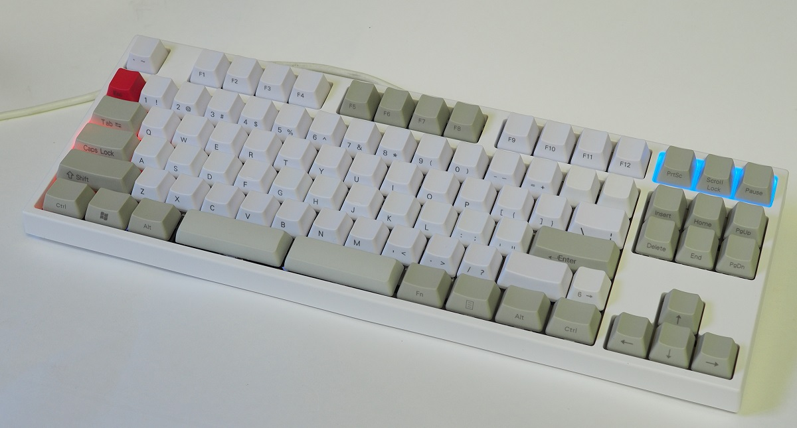
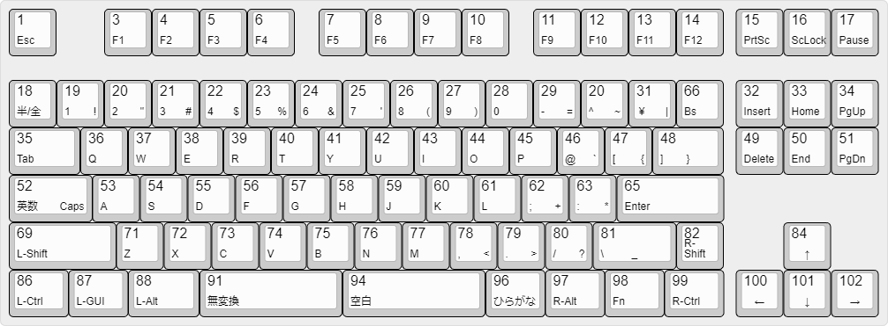
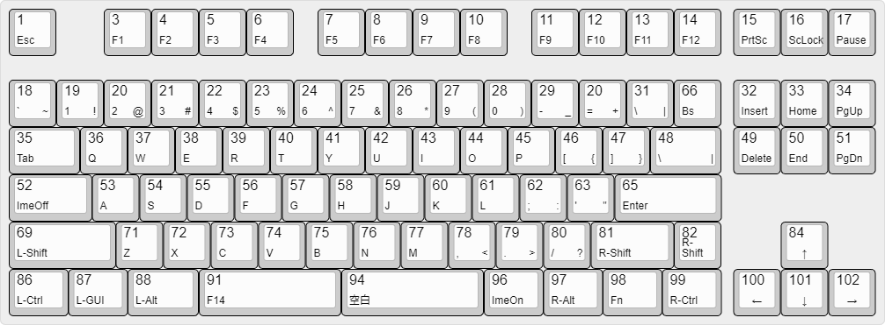
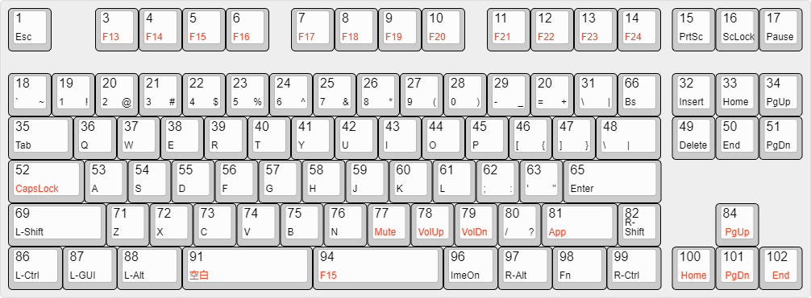

# XD87 PCBを使った ほぼNICOLAキーボード (1.7.0版)

## 概要

[kprepublic.com](https://kprepublic.com/collections/xd87-80) で売っている XD87 PCB を使って作成した親指シフト(NICOLA)型のキーボードです。PCBやスイッチプレート、ケースなどは2020年頃に購入しました。

このキーボードのハードウェアについての考察や組み立てなどについては、[ブログの投稿](https://okiraku-camera.tokyo/blog/?p=11204) を参照してください。

※ XD87 PCBのうち、HOT SWAP EDITION(XD87 HS)は分割スペースバーを<u>サポートしていない</u>ことに注意してください。

* このPCBは、6行17列のキースイッチ・マトリックス回路を備えています。今回は、90個のスイッチを使ったレイアウトとしました。
* キーキャップは入手性の都合でUSレイアウトの記号が印字されたものを使っていますが、Windowsを日本語レイアウトとして使っても(キーキャップの印字が異なるだけで)、特に問題ありません。
* このドキュメントでは日本語レイアウトとUSレイアウトの2つの図を掲載していますが、キーボードが出力するコード(HID Usage ID)自体はほとんど同じです。出力コードと文字／記号との関連付けは、キーボードではなくホスト(PC)側の仕事です。

## レイアウト図 (日本語レイアウト時)

各キー内の文字、記号、数字はWindowsのキーボードレイアウトが `日本語キーボード(106/109キー)` であることを前提しています。

### Fnキーを押してないとき(通常時) [xd87_nicola_jp_1.json](./images/xd87_nicola_jp_1.json)

### Fnキーを押しているとき [xd87_nicola_jp_1_fn.json](./images/xd87_nicola_jp_1_fn.json)

* 各キーの大きな数字は内部スキャンコードです。内部スキャンコードとは、キースイッチマトリックス回路における列と行の交点(スイッチ位置)を一意に表す番号で `(行番号 – 1) × 17 + 列番号` で算出しています。
* キーと出力コードの関係は、xd87.cpp内のコード配列 `scan_to_hid_table[ ][ ]` で定義しており、この配列には内部スキャンコード順にHID Usage IDが書いてあります。基本的な出力コードを変更する場合は、この内容を書き換えることになります。 
* Fnキーオンのとき、赤い字で書いてあるキーは通常時と異なるコードを出力します。それ以外のキーは通常時と同じコードを出力します。
* NICOLAモードの場合、キースキャンの結果として得られる出力コードがNICOLA配列の範囲内にあるとき、あらためてNICOLA配列に変換してから同時打鍵の検出処理などを行うことになります。キースキャン結果をいったんHID Usage ID に変換することで、キーイベント検出後の処理をhoboNicolaアダプターと共通化しています。
* Fnキーオンのとき、実験的にImeOnとImeOffというコードを出力するようにしてあります。これらのコードについては後述しています。

## レイアウト図 (USレイアウト)

各キー内の文字、記号、数字はWindowsのキーボードレイアウトが `英語キーボード(101/102キー)` であることを前提しています。

hoboNicolaの動作設定で、 `U : US LAYOUT`  を有効にしている必要があります。

### Fnキーを押してないとき(通常時) [xd87_nicola_us_1.json](./images/xd87_nicola_us_1.json)

### Fnキーを押しているとき [xd87_nicola_us_1_fn.json](./images/xd87_nicola_us_1_fn.json)

* 赤い字で書いてあるキーがFnキーオンのときに通常時と異なるコードを出力します。それ以外のキーは通常時と同じコードを出力します。
* USレイアウトでのCapsLockキーは、Fnキーを押しながら入力する必要があります。ほとんど使わないのでFnキー側にのみ配置することにしました。
* USレイアウトのときには、日本語キーボードが出力する一部のキーコードはWindowsによって無視されます。そのため、日本語キーボードでの無変換キーはF14に、変換キーはF15に置き換えています。
* 日本語入力IMEに対して F14で無変換キー相当の機能、F15で変換キー相当の機能を果たすようにカスタマイズしておくことで、親指シフト入力に支障はなくなります。hoboNicolaライブラリの内部でもUSレイアウト時にはそのようなコードの読み替えを行っています。

## ImeOn, ImeOffについて
* `ImeOn` と表記しているキーは、HID Usage ID 0x90 (Keyboard LANG1) を出力します。hoboNicolaLibraryでは、`HID_IME_ON` と定義しています。
* `ImeOff` と表記しているキーは、HID Usage ID 0x91 (Keyboard LANG2) を出力します。hoboNicolaLibraryでは、`HID_IME_OFF` と定義しています。

これらのコードを日本語IMEに与えることで、IMEの開閉ができることになっています。IMEを開いたときの入力文字種については、前回の閉じた直前の文字種を踏襲するものと、そうでなく、必ず `ひらがな` になるIMEがあるようです。必ず `ひらがな` になってくれる方が助かります。

## USレイアウトでのIMEのカスタマイズについて
たとえば、Google日本語入力に対しては以下のようなキー設定を追加することで、おおむね MSIMEスタイルの入力操作を踏襲できます(無変換キーが関係するコマンドをそのまま利用)。

| モード | 入力キー | コマンド |
|:------|:---------|:--------|
|入力文字なし|F14|ひらがなに入力切替|
|変換前入力中|F14|ひらがなに変換|
|変換中|F14|ひらがな・カタカナを切替|
|直接入力|F14|ひらがなに入力切替|
|||

## ビルドについて
このPCBに実装されているマイコンは `Atmel ATMega32U4(+5V, 16MHz)` で、このマイコンには AtmelのDFUブートローダーが書き込まれています。	Arduino (IDEもしくはarduino-cli) でビルドするときには Arduino Leonardo もしくは SparkFun Pro Micro(+5V/16MHz) として行います。そしてキーボード内のマイコンを `DFUブートローダーモード`とし、できあがったHEXファイルを ATmel Flip などのツールで書き込みます。DFUブートローダーモードは、キーボードマイコンのリセット、あるいは、hoboNicola が備えているキー入力操作 (Fn+右Ctrl+左Ctrl+B) で開始します。

[戻る/Back](./about_hoboNicola_jp.md)
