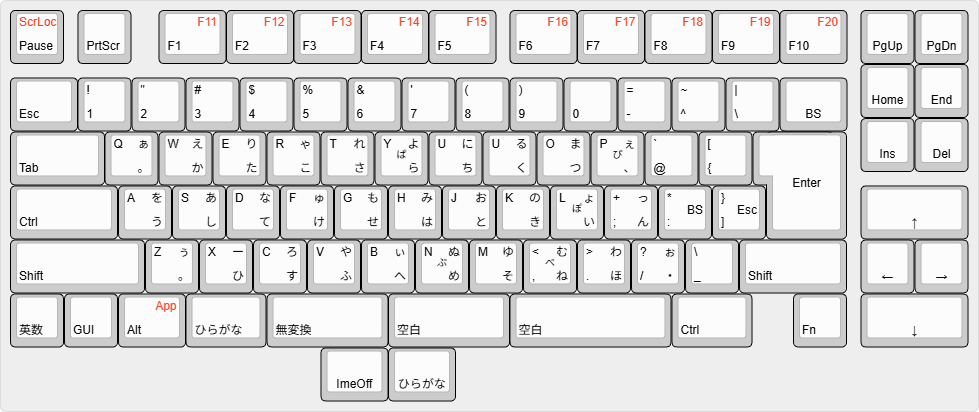

## Hobo-nicola keyboard implementation for ASkeyboard (Seeed Seeeduino SAMD21).

*askb_xiao_hobo_nicola*

Copyright (c) Takeshi Higasa. Licensed under the GPL3.0.

version 1.7.9 Feb. 11, 2026 

* To build this software you will need :
  * ASkeyboard (Seeed xiaoduino SAMD21 version). https://okiraku-camera.tokyo/blog/?p=14991
  * core package : Seeed samd 1.8.5 (https://files.seeedstudio.com/arduino/package_seeeduino_boards_index.json)
  * Adafruit TinyUSB Library for Arduino : Version 3.2.0
  * hoboNicola Library : Version 1.7.9
 
* In Arduino Board configuration : 
  * Board: Seeeduino XIAO
  * USB Stack: Adafruit TinyUSB

* Firmware Update : 
  * Arduino CDC method.

# レイアウトについて 
* 専用親指キーでの入力操作を評価できるように、2つの動作モードを用意した。
* リセット時には通常モードとして開始する。
* 専用親指キーモードとするためには、Fn + 左Ctrl + 右Ctrl + A によって切り替える。

## 通常モード
* 2つの親指キーは、同時打鍵とコードの出力の2つの機能を備える。
* 親指キーの下にある2つのキーは、IME操作用に ImeOffとひらがなキーとしている。

## 専用親指キーモード
* 2つの親指キーは同時打鍵専用となり単独打鍵ではコードを出力しない。
* 下の2つのキーは無変換キーと変換キーのコードを出力する。
* IMEのオフは英数キーで行えるが、押しにくい。Fn + 左親指キーでもIMEオフにできる。

以上）